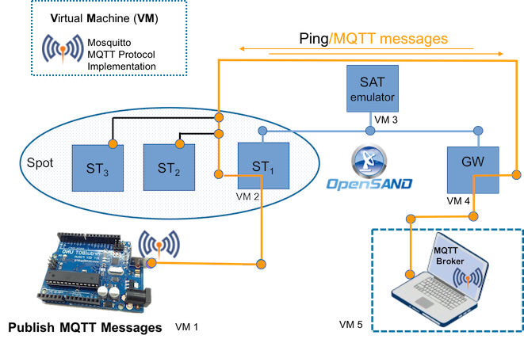

## Mosquitto Performance Tester



This projects contains a set of Python scripts used to test the performance of MQTT over SAT links.
It basically publish several messages with different payload size to a specific MQTT
broker that is host on the other side of a Satellite network.
We used OpenSAND to simulate the SAT link and Mosquitto as MQTT Broker implementation.


#Getting Started

There are several information required to start this test.
These are stored (at the moment) in the init file of the module.
Here the list:

* Payload size: from 128 to 1280 bytes are general used values
* QoS: Quality of Service used by Mosquitto (1 or 2)
* Topic: where the message will be publish
* Host: this is the real location where the publish wil be sent
* Interface: this is the interface to sniff MQTT & TCP traffic.

# Prerequisites

Python2 or 3 is requires and a linux based OS

## Running the tests.

To start the test first of all please check that all params are set properly in the init file.
Then, a simple shell script is available in the root of the project

```bash
sudo ./start.sh
```

or use the python syntax as follow:

```bash
python -m tester
```


## Install Mosquitto on MAC OsX
Since I had some issues installing  Mosquitto on Mac I put this useful [link: install-mqtt-server](https://simplifiedthinking.co.uk/2015/10/03/install-mqtt-server/)


## Authors

* [Luca Lamorte](mailto:luca.lamorte@gmail.com) - Initial work - [M2M SAT Project](https://artes.esa.int/projects/m2msat)

See also the list of [contributors](contributors.md) who participated in this project.


## Acknowledgments

### FreeBSD License
Copyright (c) Luca Lamorte

All rights reserved.

Redistribution and use in source and binary forms, with or without modification, are permitted provided that the following conditions are met:
* Redistributions of source code must retain the above copyright notice, this list of conditions and the following disclaimer.
* Redistributions in binary form must reproduce the above copyright notice, this list of conditions and the following disclaimer in the documentation and/or other materials provided with the distribution.

THIS SOFTWARE IS PROVIDED BY THE COPYRIGHT HOLDERS AND CONTRIBUTORS "AS IS" AND ANY EXPRESS OR IMPLIED WARRANTIES, INCLUDING, BUT NOT LIMITED TO, THE IMPLIED WARRANTIES OF MERCHANTABILITY AND FITNESS FOR A PARTICULAR PURPOSE ARE DISCLAIMED. IN NO EVENT SHALL THE COPYRIGHT HOLDER OR CONTRIBUTORS BE LIABLE FOR ANY DIRECT, INDIRECT, INCIDENTAL, SPECIAL, EXEMPLARY, OR CONSEQUENTIAL DAMAGES (INCLUDING, BUT NOT LIMITED TO, PROCUREMENT OF SUBSTITUTE GOODS OR SERVICES; LOSS OF USE, DATA, OR PROFITS; OR BUSINESS INTERRUPTION) HOWEVER CAUSED AND ON ANY THEORY OF LIABILITY, WHETHER IN CONTRACT, STRICT LIABILITY, OR TORT (INCLUDING NEGLIGENCE OR OTHERWISE) ARISING IN ANY WAY OUT OF THE USE OF THIS SOFTWARE, EVEN IF ADVISED OF THE POSSIBILITY OF SUCH DAMAGE.

